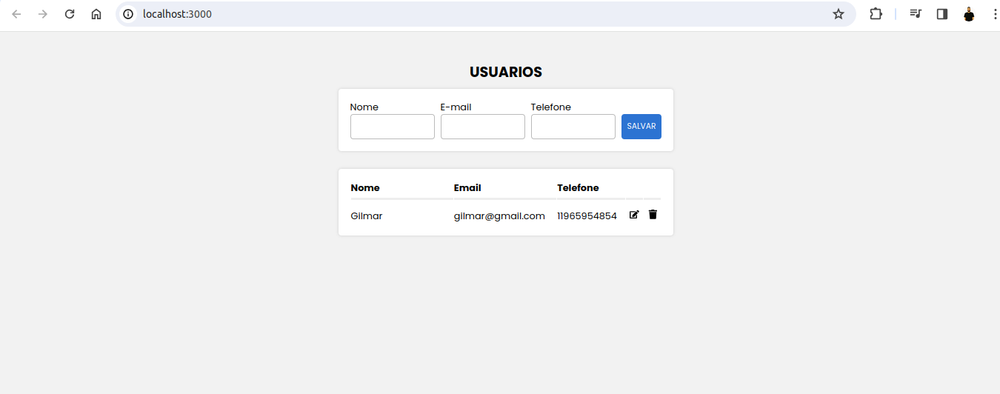

<h1 align="center">Gerenciador de Acesso</h1>

  <a href="#-tecnologias">Tecnologias</a>&nbsp;&nbsp;&nbsp;|&nbsp;&nbsp;&nbsp;
  <a href="#-projeto">Projeto</a>&nbsp;&nbsp;&nbsp;|&nbsp;&nbsp;&nbsp;
  <a href="#-layout">Layout</a>&nbsp;&nbsp;&nbsp;

  

 

  

[🔗 Clique aqui para acessar](https://linktree-natapires.vercel.app/)

## 🛠 Tecnologias

Esse projeto foi desenvolvido com as seguintes tecnologias:

- HTML
- React.js, Node.js
- Git & Github

# Começando com o Create React App

Este projeto foi iniciado com [Create React App](https://github.com/facebook/create-react-app).

## Scripts disponíveis

No diretório do projeto, você pode executar:

### `npm start`

Executa o aplicativo no modo de desenvolvimento.
Abra [http://localhost:3000](http://localhost:3000) para visualizá-lo no seu navegador.

A página será recarregada quando você fizer alterações.\\
Você também pode ver quaisquer erros de lint no console.

### `npm test`

Lança o executor de testes no modo de observação interativa.\\
Veja a secção sobre [running tests](https://facebook.github.io/create-react-app/docs/running-tests) para mais informações.

### `npm run build`

Constrói a aplicação para produção na pasta `build`.\
Ele empacota corretamente o React no modo de produção e otimiza a compilação para o melhor desempenho.

O build é minificado e os nomes dos arquivos incluem os hashes.\\
Seu aplicativo está pronto para ser implantado!

Veja a secção sobre [deployment](https://facebook.github.io/create-react-app/docs/deployment) para mais informações.

## Saiba mais

Você pode saber mais na [Documentação do aplicativo React] (https://facebook.github.io/create-react-app/docs/getting-started).

Para aprender React, confira a [Documentação do React](https://reactjs.org/).

## 💻 Projeto

Feito com ♥ by Natã Pires :wave: [Entre em contato pelo Linkedln](https://www.linkedin.com/in/nat%C3%A3-pires-ferreira-7062281a0/)